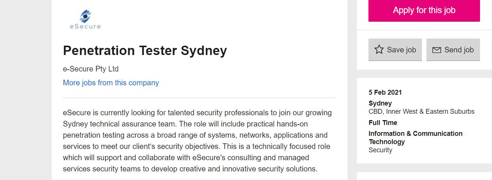
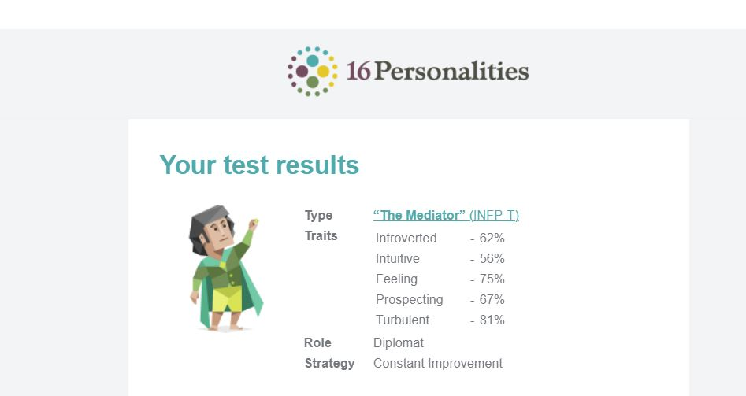
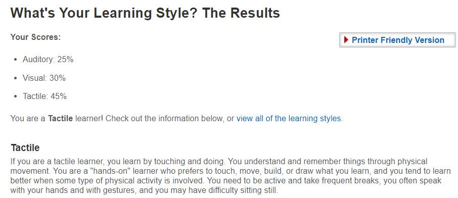
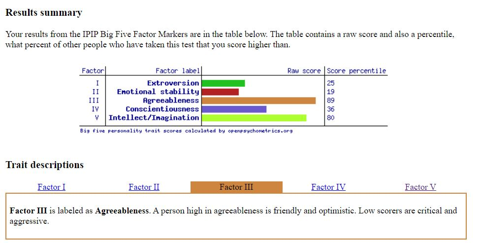

# Assignment 1 - Introduction to IT
Mark Parisotto s3910961

<h2> About </h2>

My name is Mark. I was born in Sydney and come from an Italian background, through which I can speak a bit of the language. I completed my first five years of schooling in Sydney before I moved to Griffith in regional NSW, which is where I stayed until completing my HSC in 2015. Before I started my current employed as a Health Information Officer at a private hospital in Melbourne, I worked at two separate petrol stations as a customer service attendant and while I've enjoyed all my work so far, it's not something I see myself doing for the rest of my life, which is why I've decided to pursue IT.
<h4> Hobbies </h4>
<ul>
  <li> Gaming (just about every genre) </li>
  <li> Sport (both codes of Rugby and Soccer) </li>
  <li> Music (mainly classic rock and metal) </li>
  <li> Cars (fixing them or simply admiring them) </li>
  </ul>
  
  <h2> Interest in IT </h2>
  I have always had a strong interest in the IT field, which basically started when I was a little kid playing basic flash games on my parent’s computer. Over time, this basic interest became stronger and lead me to taking IT based electives in high school and eventually onto starting a Diploma of IT. Adding to that being from a fairly tech-savvy family definitely contributed to my interest. I would say my main interests in IT would definitely be network security and programming AI, especially for robots.

I want to study with RMIT because I believe they can offer me one of the best looked upon qualifications in the professional world, which would in turn increase my job prospects as I look to build a career for myself in the world of cyber security and more specifically my ideal job as a penetration tester. I thought studying through Open Universities was also a really good option, as it allows me to be flexible with combing study and work.

I expect to learn relevant topics and subjects that will aid me in finding work after my study. Personally, with the interests that I have I would love to go into further depth with programming and networking, as careers in these fields are what I aspire to achieve.

<h2> Ideal Job </h2>
I would consider Penetration Testing as my ideal job and something I will be aiming to work towards over the course of my studies here at RMIT. From my knowledge, a penetration tester is responsible for testing network security and integrity through various means such as exploitation software similar to how an unethical hacker would attempt to gain access. It is with these findings that they write up reports detailing how access was gained (if it was) and suggestions on how to improve security. What makes it interesting to me is basically getting the license to hack and try and gain access, really testing one’s knowledge on how to think outside the box and because of this I believe that it is a job that to me would never get old and stale.

Experience in network security would be required as the job is quite specialist, along with this knowledge of various security styles and techniques would also go a long way. Knowledge in with network penetration tools and experience in red teaming would be beneficial as it is a major part of the job. Participating in hacking challenges is also a bonus, along with a proficiency in programming and any IT industry certifications and awards (CREST and OSCP).

At this stage, I understandably have none of these qualifications, certifications, or experience, though I do believe I possess the necessary lateral thinking required by the job. Over the duration of this course, my goal is to strengthen my knowledge in networking to the point that along with the completed degree I would provide outstanding knowledge to apply for a job in network security. Once in the professional world, with sufficient skill and experience, I would aim for the completion of hacking challenges and contests and any certifications that might be relevant and looked favorably upon. I believe these along with the years of experience I would have would put me in good stead to apply for this job.

https://www.seek.com.au/job/51464905?type=promoted#searchRequestToken=e79357cf-b53e-4b27-a852-12ed97953a59

<h2> Personal Profile </h2>
<h4> Myers-Briggs Test </h4>

<h4> Learning Style Test </h4>

<h4> Big 5 Personality Test </h4>

